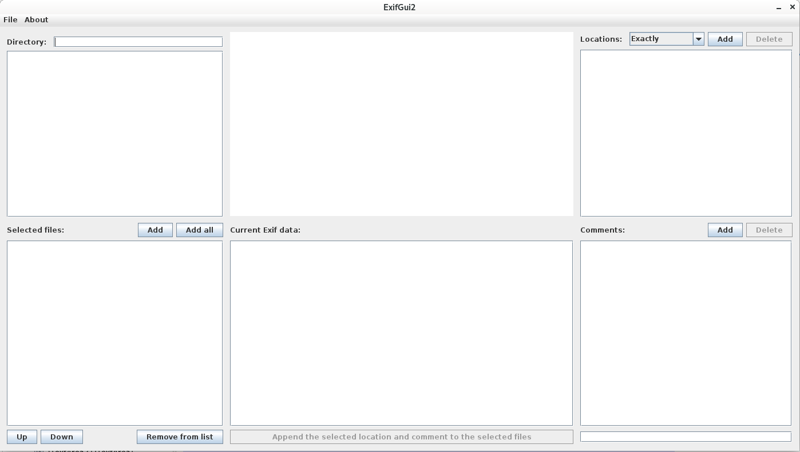
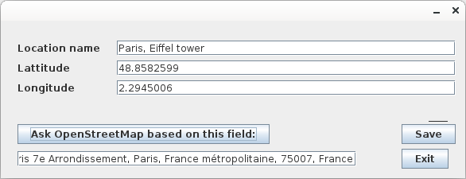

# ExifGui

## Standalone runnable version: 
https://github.com/brinckengyurika/ExifGui/blob/main/ExifGui-1.0.jar
Start: java -jar ExifGui-1.0.jar

## Modify the Location and the User Comment Exif fields of group of images:

- Manage your Locations: ask and save your interested places from the openstreetmap database.

- Save your own comments (for example: My wedding party, Wacations, Formula 1 race, etc....).
- Select the related images in your filesystems.
- Apply the seleted Location and Comments on the images.
  - Location modifiers:
    - Exactly - All image placed to same coordinate
    - Circle - The images placed around the coordinate in circles
    - Matrix - The images placed in grid

If you find this tool helpful and would like to support its development, you can make a donation via PayPal:

https://paypal.me/GyorgyBrincken

Thank you for your support!
