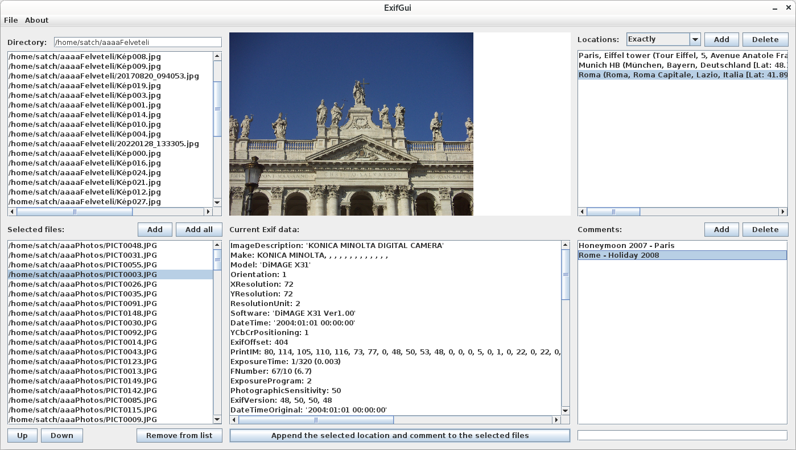

# ExifGui
## Modify the Location and the User Comment Exif fields of group of images:

- Manage your Locations: ask and save your interested places from the openstreetmap database.

- Save your own comments (for example: My wedding party, Wacations, Formula 1 race, etc....).
- Select the related images in your filesystems.
- Apply the seleted Location and Comments on the images.
